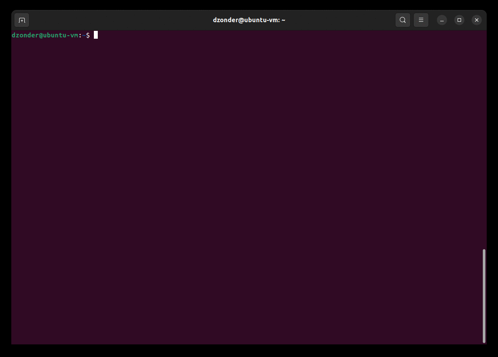

# SSHells

Simple utility that can be used as a default OpenSSH shell that lets you pick the shell after establishing SSH connection.

<p align="center">
  
</p>

## Setup

### Windows 

Install (execute in elevated PowerShell):

```PowerShell
# Install using WinGet (Windows Package Manager).
winget install dzonder.sshells

# Set the default shell in OpenSSH.
# https://learn.microsoft.com/en-us/windows-server/administration/openssh/openssh_server_configuration#configuring-the-default-shell-for-openssh-in-windows
New-ItemProperty -Path "HKLM:\SOFTWARE\OpenSSH" -Name DefaultShell -Value "$env:LOCALAPPDATA\Microsoft\WinGet\Links\sshells.exe" -PropertyType String -Force
```

Uninstall (execute in elevated PowerShell):

```PowerShell
# Uninstall using WinGet (Windows Package Manager).
winget uninstall dzonder.sshells

# Restore cmd.exe as the default shell in OpenSSH.
Remove-ItemProperty -Path "HKLM:\SOFTWARE\OpenSSH" -Name DefaultShell
```

## Configuration (optional)

To change the default shells edit `config.json`:

```PowerShell
# Edit the config.json using notepad.
notepad $env:ProgramData\dzonder\SSHells\config.json
```

See [src/config.json](src/config.json) for an example. Default configuration will be written upon first run of `sshells.exe`.
